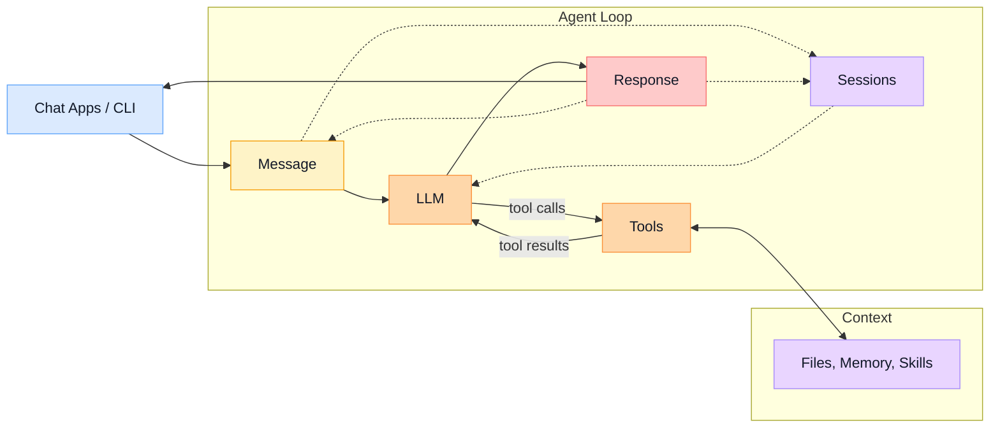

<div align="center">
  
  <h1>picoclaw: Lightweight Personal AI Assistant <br>Single Binary, Simple Setup</h1>
</div>

This project is inspired by **OpenClaw** and **nanobot**.

## Why picoclaw

📦 **Single binary, small footprint**: Runs as one executable with minimal moving parts.

📖 **Readable**: Straightforward organization so it’s easy to understand, modify, and extend.

✅ **Easy to adopt**: `onboard` creates a ready-to-edit workspace and config; you can start chatting immediately.

## Install

Prebuilt binaries are published on GitHub Releases (via GoReleaser).

macOS example (Apple Silicon):

```bash
curl -L -o picoclaw.tar.gz \
  https://github.com/mosaxiv/picoclaw/releases/latest/download/picoclaw_Darwin_arm64.tar.gz
tar -xzf picoclaw.tar.gz
chmod +x picoclaw
mkdir -p ~/.local/bin
mv picoclaw ~/.local/bin/
picoclaw --help
```

## Quick Start

```bash
# Initialize
picoclaw onboard \
  --openrouter-api-key "sk-or-..." \
  --model "openrouter/anthropic/claude-sonnet-4.5"

# Check effective configuration
picoclaw status

# Chat
picoclaw agent -m "What is 2+2?"
```

## Architecture



## Workspace (How picoclaw “thinks”)

Default workspace: `~/.picoclaw/workspace` (override with `--workspace` or `PICOCLAW_WORKSPACE`).

Files in the workspace are automatically injected into the system prompt when present:

- `AGENTS.md`: contributor/user instructions for the agent
- `SOUL.md`, `USER.md`, `IDENTITY.md`: personalization and guardrails
- `TOOLS.md`: tool reference for humans
- `HEARTBEAT.md`: periodic tasks
- `memory/`: long-term and daily notes

This matches the “workspace-first” style: you control behavior by editing small, versionable text files.

## Configuration (`~/.picoclaw/config.json`)

Config file: `~/.picoclaw/config.json`

### Supported providers

picoclaw currently supports these LLM providers:

- **OpenAI** (`openai/<model>`, API key: `env.OPENAI_API_KEY`)
- **OpenRouter** (`openrouter/<provider>/<model>`, API key: `env.OPENROUTER_API_KEY`)

Minimal config (OpenRouter):

```json
{
  "env": { "OPENROUTER_API_KEY": "sk-or-..." },
  "agents": { "defaults": { "model": "openrouter/anthropic/claude-sonnet-4-5" } }
}
```

picoclaw will fill in sensible defaults for missing sections (tools, gateway, cron, heartbeat, channels).

### Safety defaults

picoclaw is conservative by default:

- `tools.restrictToWorkspace` defaults to `true` (tools can only access files inside the workspace directory)

## Chat Apps

Chat app integrations are configured under `channels` (examples below).

<details>
<summary><b>Discord</b></summary>

1. Create a bot in Discord Developer Portal and copy the bot token.
2. Enable required intents (MESSAGE CONTENT INTENT recommended).
3. Set `channels.discord.allowFrom` to user IDs that are allowed to talk to the agent.
   - If empty, all users are allowed.
4. Set `channels.discord.enabled=true` and `channels.discord.token`.

Example config (merge into `~/.picoclaw/config.json`):

```json
{
  "channels": {
    "discord": {
      "enabled": true,
      "token": "YOUR_BOT_TOKEN",
      "allowFrom": ["YOUR_USER_ID"],
      "intents": 37377
    }
  }
}
```

Note: `37377` enables `GUILDS + GUILD_MESSAGES + DIRECT_MESSAGES + MESSAGE_CONTENT`.

Then run:

```bash
picoclaw gateway
```

</details>

<details>
<summary><b>Slack (Events API)</b></summary>

1. Create a Slack App and obtain:
   - Bot token (`xoxb-...`)
   - Signing secret
2. Enable Event Subscriptions and set the Request URL to:
   - `http(s)://<host>:18790/slack/events` (or your `gateway.listen` + `channels.slack.eventsPath`)
3. Set `channels.slack.allowFrom` to user IDs that are allowed to talk to the agent.
   - If empty, all users are allowed.
4. Set `channels.slack.enabled=true`, and configure `botToken` + `signingSecret`.

Note: gateway startup fails closed if `signingSecret` is empty.

Example config (merge into `~/.picoclaw/config.json`):

```json
{
  "gateway": { "listen": "0.0.0.0:18790" },
  "channels": {
    "slack": {
      "enabled": true,
      "allowFrom": ["U012345"],
      "botToken": "xoxb-...",
      "signingSecret": "YOUR_SIGNING_SECRET",
      "eventsPath": "/slack/events"
    }
  }
}
```

Then run:

```bash
picoclaw gateway
```

</details>

## CLI Reference

| Command | Description |
| --- | --- |
| `picoclaw onboard` | Initialize a workspace and write a minimal config. |
| `picoclaw status` | Print the effective configuration (after defaults and routing). |
| `picoclaw agent` | Run the agent in CLI mode (interactive or single message). |
| `picoclaw gateway` | Run the long-lived gateway (channels + cron + heartbeat). |
| `picoclaw channels status` | Show which chat channels are enabled/configured. |
| `picoclaw cron list` | List scheduled jobs. |
| `picoclaw cron add` | Add a scheduled job. |
| `picoclaw cron remove` | Remove a scheduled job. |
| `picoclaw cron toggle` | Enable/disable a scheduled job. |
| `picoclaw cron run` | Run a job immediately. |

### `picoclaw cron add` formats

`--message` is required, and exactly one of `--every`, `--cron`, or `--at` must be set.

```bash
# Every N seconds
picoclaw cron add --message "summarize my inbox" --every 3600

# Cron expression (5-field)
picoclaw cron add --message "daily standup notes" --cron "0 9 * * 1-5"

# Run once at a specific time (RFC3339)
picoclaw cron add --message "remind me" --at "2026-02-10T09:00:00Z"

# Deliver to a chat (requires both --channel and --to)
picoclaw cron add --message "ping" --every 600 --channel slack --to U012345
```
